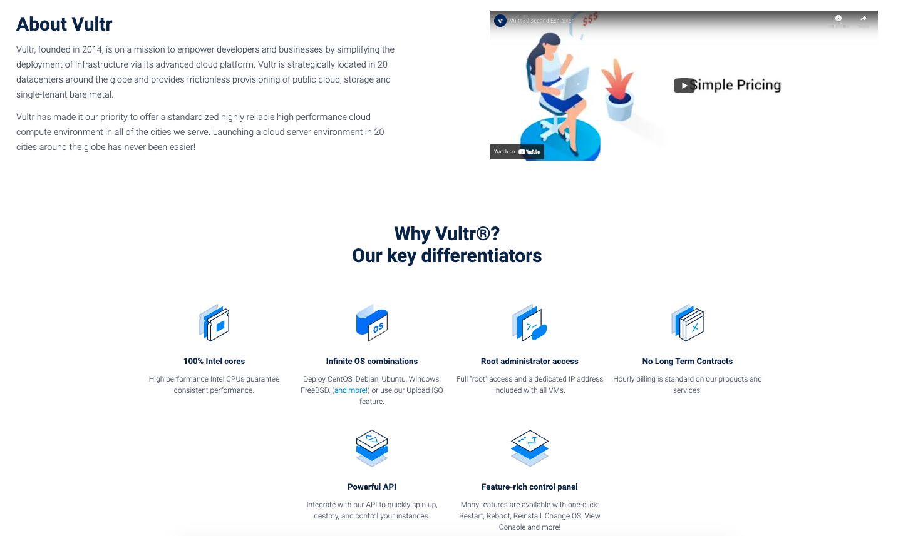

# Marketing page for Vultr
- This is an assignment that requires building a marketing page for Vultr based on an existing promo page.
- The page was built with assets provided by Vultr.
- **Disclaimer: This page was built for learning purpose.

## Technologies
The page was built with JS, HTM and CSS and a little bit of jQuery.

## Demonstration:

The link for the page is: 
- https://vultr-marketing-page.netlify.app/

## References:
- https://www.vultr.com/company/brand-assets/
- https://www.vultr.com/promo/cycle50/
- https://www.youtube.com/vultr

## License
[MIT](https://choosealicense.com/licenses/mit/)
